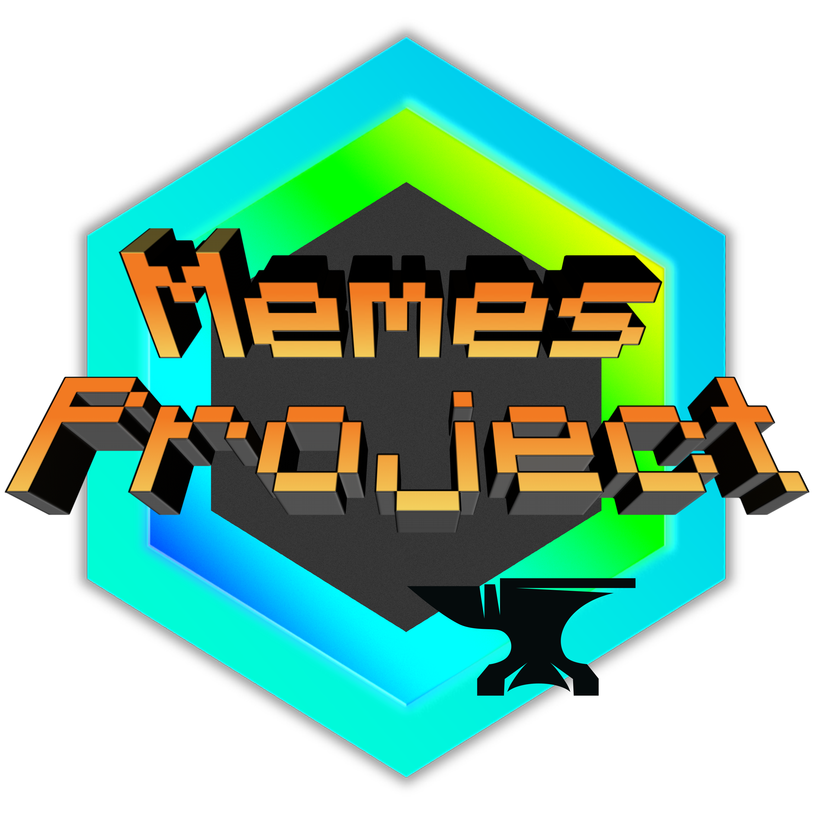

 
 <h2 align="center">MemesProject-Forge</h2>
 

 

[简体中文 README](README.md)

**This mod is still under DEVELOPMENT,If you want to add this MOD to the game, 
please BACKUP and save it FIRST!!!**

This mod will now be refined in 1.16.x, and will support 1.18.x when completed. Versions after 0.1b3 require Patchouli as a prefix.

Item comment translation problem: Since MCreator is hard-coded, you can use [DynTranslation](https:www.mcmod.cnclass2387.html) to translate it yourself (Only Forge).

The disc of this mod has been split into another mod (MemesProject ReDisc). MemesProject & MemesProject ReDisc is being ported to fabric 
(Note: ~~The development of the Fabric version has been temporarily suspended, and the Forge version is now being improved~~ MemesProject ReDisc has been ported, MemesProject is being ported). 

