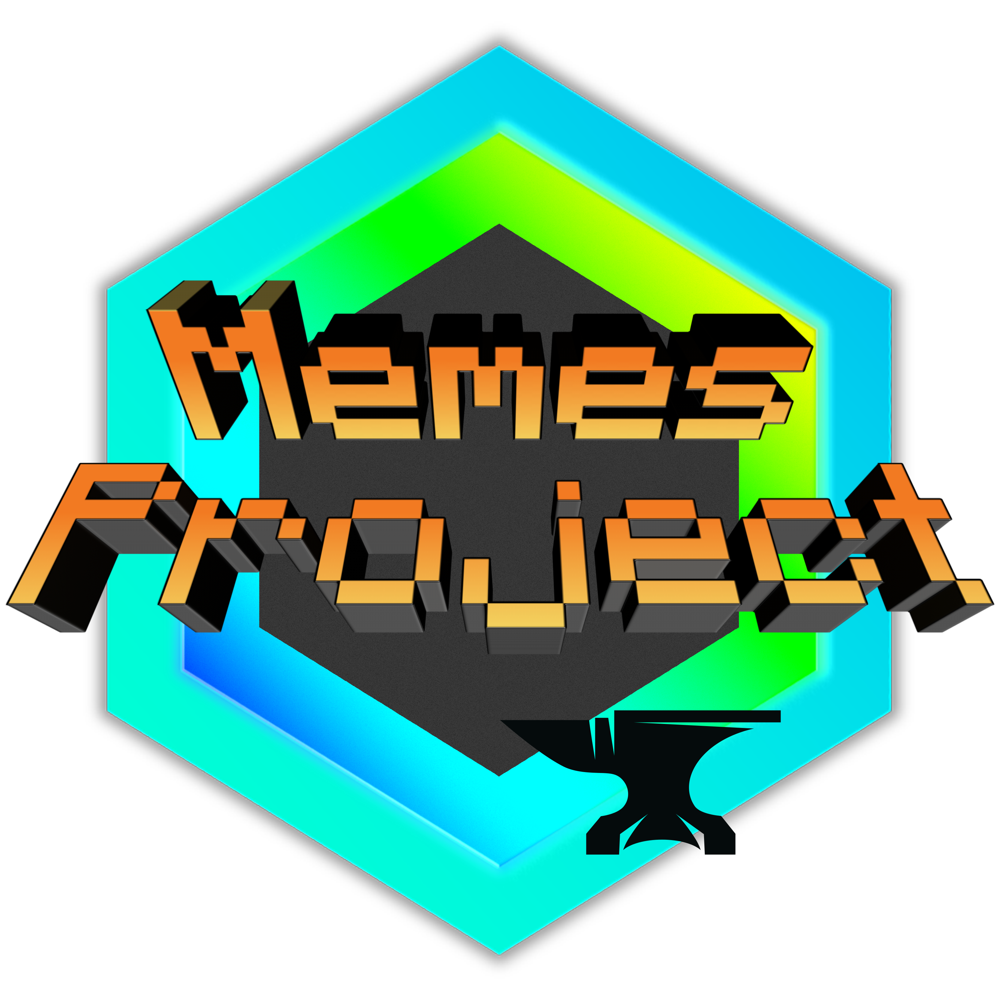

 
 <h2 align="center">MemesProject-Forge</h2>
 

 

[English README](README-EN.md)

**此Mod还在处于开发阶段，如果想把此模组加入游戏中，请先备份存档！！！**

现将在1.16.x完善此模组，完善后将会支持1.18.x。 在0.1b3之后的版本需要Patchouli作为前置。

物品注释翻译问题：由于MCreator使用了硬编码，你可以使用 [DynTranslation](https://www.mcmod.cn/class/2387.html) 自行进行翻译（仅限Forge）

已将此模组的唱片拆分为另一个模组（MemesProject ReDisc）。正在将 MemesProject / MemesProject ReDisc 移植到fabric
(注：~~目前已暂停Fabric版本开发，现以完善Forge版本为主，完善后将移植到Fabric~~ 目前已将MemesProject ReDisc移植，MemesProject正在移植)。

